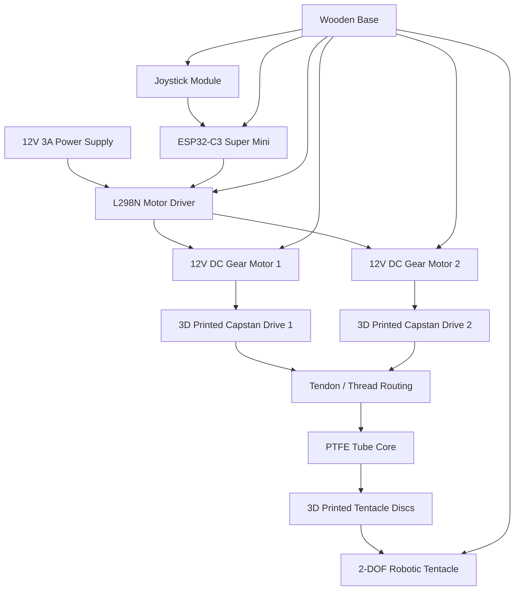

# robotictentacle

2-DOF robotic tentacle powered by dual 12V geared hobby motors, an L298N motor driver, and an ESP32-C3 Super Mini. Features joystick control and dual 3D-printed capstan drives for tendon actuation. Uses standard thread for proof-of-concept, with support for stronger nylon or cable-based tendons.

## Project Status

This project is currently a **proof of concept**. It demonstrates a low-cost tendon-driven robotic tentacle mechanism using hobby motors, 3D-printed capstan drives, and an ESP32-C3 controller.

The current version is not intended as a finished functional robotic manipulator. The long-term goal is to improve the mechanical design, tendon routing, materials, and control system so the concept can be used in more practical robotic systems, such as:

- Soft robotic grippers
- Tendon-driven manipulators
- Biomimetic robotic arms
- Educational robotics demos
- Low-cost actuation experiments

## System Overview

The tentacle uses a flexible PTFE tube as the central spine. 3D-printed discs are spaced along the tube to create the tentacle body. Threads are routed through aligned holes in the discs and wrapped around two 3D-printed capstans. Each capstan is driven by a 12V geared DC hobby motor.

The motors are controlled by an L298N H-bridge motor driver, which is connected to an ESP32-C3 Super Mini. A joystick provides manual control over the two axes of motion.

## System Breakdown



## Bill of Materials

| Item | Quantity | Notes |
|---|---:|---|
| ESP32-C3 Super Mini | 1 | Main microcontroller |
| L298N motor driver | 1 | Dual H-bridge motor driver |
| 12V DC geared hobby motors | 2 | Used to drive the capstans |
| 12V 3A power supply | 1 | Main motor power supply |
| Analog joystick module | 1 | Used for manual control |
| Breadboard | 1 | For prototyping connections |
| Jumper wires / hookup wires | As needed | Signal and power wiring |
| Wooden baseboard | 1 | Mounting platform for the full assembly |
| PTFE tube | 1 length | Main flexible core of the tentacle |
| 3D printed tentacle discs | Multiple | Sorted by size and placed along the PTFE tube |
| 3D printed capstan drives | 2 | One for each motion axis |
| Thread | As needed | Proof-of-concept tendon material |
| Needle | 1 | Used to route thread through the discs |
| PLA filament | As needed | Used for 3D printed parts |
| Hot glue or super glue | As needed | Used to secure discs and tendons |
| Solder | As needed | For electrical connections if needed |

## Required Tools

| Tool | Purpose |
|---|---|
| 3D printer | Printing discs, capstans, and mounts |
| Soldering iron | Securing wires and electrical connections |
| Hot glue gun | Attaching parts and securing tendons |
| Screwdriver | Mounting motors and hardware |
| Wire stripper / cutter | Preparing wires |

## 3D Printing Settings

The prototype parts were printed using standard PLA settings.

Recommended starting settings:

| Setting | Value |
|---|---|
| Material | PLA |
| Infill | 25% gyroid |
| Layer height | 0.2 mm |
| Walls | 2-3 |
| Supports | As needed depending on part orientation |

These settings are not strict. The parts do not require extremely high strength, but the capstans and base mounts should be sturdy enough to avoid snapping under tendon tension.

## Mechanical Assembly

### 1. Prepare the Base

Start with a wooden baseboard large enough to hold:

- The two motors
- The L298N motor driver
- The ESP32-C3 Super Mini
- The joystick module
- The breadboard or wiring area
- The tentacle assembly

Mount the two 12V geared DC motors onto the base. Make sure the motor shafts are accessible and aligned with where the capstan drives will sit.

### 2. Prepare the PTFE Core

Cut the PTFE tube to the desired tentacle length. This tube acts as the main flexible spine of the robot.

The PTFE tube is the core of the build. The 3D-printed discs slide onto it, and the tendon threads run along the outside through aligned holes in the discs.

### 3. Sort the Tentacle Discs

Print all tentacle discs and sort them in order of size.

The discs should be installed along the PTFE tube with consistent spacing. A spacing of around **5-10 mm** between discs is recommended.

Smaller spacing can create a more continuous and dexterous tentacle shape, while larger spacing makes assembly easier and reduces the number of printed parts required.

### 4. Install the Discs

Slide the first disc onto the PTFE tube. Add hot glue or super glue around the contact area to secure it in place.

Continue adding discs one by one.

Important: make sure the tendon holes in every disc are aligned. If the holes are not aligned, the tendons will twist or bind later during assembly.

Recommended process:

1. Add one disc to the PTFE tube.
2. Align the four tendon holes.
3. Apply hot glue or super glue.
4. Add the next disc with the same spacing.
5. Repeat until the tentacle body is complete.

### 5. Prepare the Capstan Drives

Print two capstan drives: one for each axis of motion.

Each capstan controls one pair of opposing tendon directions.

For each capstan:

1. Take one end of the thread.
2. Wrap it around one side of the capstan about 5 times.
3. Feed the thread through the center hole or anchor point.
4. Secure it with a knot, hot glue, or both.
5. Repeat for the other side of the capstan if using opposing tendon pulls.

The goal is for the capstan to wind one side of the tendon while releasing the other side.

### 6. Route the Tendons

Use a needle to route the thread through the holes in the tentacle discs.

Route the tendons through the full length of the tentacle and back toward the motor/capstan area.

Tips:

- Route the upper axis first to avoid access issues later.
- Keep the threads as straight as possible.
- Avoid crossing or twisting tendons.
- Make sure each tendon path passes through the matching aligned hole in every disc.
- Leave extra thread length for tensioning and adjustment.

This prototype uses regular thread as a proof of concept. For future versions, the thread can be replaced with stronger materials such as nylon string, braided fishing line, cable, or other tendon materials.

### 7. Mount the Tentacle Assembly

Mount the tentacle base to the wooden board. The tentacle should start upright in its neutral position.

Make sure the tendons can travel freely from the tentacle body to the capstans without rubbing sharply against the base or hardware.

### 8. Mount Electronics

Mount the following onto the wooden baseboard:

- ESP32-C3 Super Mini
- L298N motor driver
- Breadboard
- Joystick module
- Power input wiring

Keep motor power wiring separated from signal wiring where possible to reduce electrical noise.

## Wiring

### L298N to ESP32-C3 Super Mini

| L298N Pin | ESP32-C3 Super Mini Pin | Purpose |
|---|---|---|
| IN1 | GPIO4 | Motor A direction control |
| IN2 | GPIO5 | Motor A direction control |
| IN3 | GPIO6 | Motor B direction control |
| IN4 | GPIO7 | Motor B direction control |
| ENA | GPIO10 | Motor A PWM speed control |
| ENB | GPIO3 | Motor B PWM speed control |
| GND | GND | Common ground |

### Joystick to ESP32-C3 Super Mini

| Joystick Pin | ESP32-C3 Super Mini Pin | Purpose |
|---|---|---|
| VRx | GPIO0 | X-axis analog input |
| VRy | GPIO1 | Y-axis analog input |
| SW | GPIO20 | Joystick button input |
| VCC | 3V3 | Joystick power |
| GND | GND | Ground |

Do not power the joystick from 5V. The ESP32-C3 uses 3.3V logic and its analog inputs should not receive 5V.

### Motors to L298N

| Motor | L298N Output |
|---|---|
| Motor A | OUT1 and OUT2 |
| Motor B | OUT3 and OUT4 |

### Power Wiring

| Power Connection | Destination |
|---|---|
| 12V power supply positive | L298N 12V input |
| 12V power supply negative | L298N GND |
| ESP32-C3 GND | L298N GND |

Use a common ground between the ESP32-C3 and the L298N. The ESP32-C3 can be powered separately over USB during development.

Do not power the ESP32-C3 directly from the L298N 5V output unless the regulator behavior has been verified. Motor drivers can introduce noise and voltage dips that may reset the microcontroller.

## Control Mapping

| Joystick Direction | Tentacle Action |
|---|---|
| Left / Right | Axis 1 movement |
| Forward / Backward | Axis 2 movement |
| Button press | Stop motors |

The current firmware directly maps joystick direction to motor direction. Releasing the joystick stops the motors. There is no closed-loop position control in this proof-of-concept version.

## Example Arduino Pin Definitions

```cpp
// L298N -> ESP32-C3 Super Mini
#define IN1 4
#define IN2 5
#define IN3 6
#define IN4 7
#define ENA 10
#define ENB 3

// Joystick
#define JOY_X 0
#define JOY_Y 1
#define JOY_SW 20
```

## Notes and Limitations

This build is experimental and has several limitations:

- No position feedback
- No encoders
- No force sensing
- No closed-loop control
- Thread can stretch or slip
- Capstan tension may need frequent adjustment
- Motion depends heavily on tendon routing and friction
- The tentacle may not return perfectly to center without mechanical improvements

For better performance, future versions should consider:

- Stronger tendon material
- Improved capstan geometry
- Better tendon tensioning system
- Bearings or low-friction guides
- Encoders for motor feedback
- Limit switches or homing sensors
- Flexible printed body sections
- Silicone or soft robotic segments
- Closed-loop position control

## Future Improvements

Planned or possible improvements include:

- Replacing thread with nylon line or braided cable
- Adding mechanical tensioners
- Designing a more rigid motor mount
- Adding feedback sensors
- Improving the tentacle body geometry
- Testing different disc spacing
- Adding automatic center calibration
- Developing a soft robotic gripper based on the same tendon-driven concept
- Creating a more compact PCB-based control system

## Media

This project was made in collaboration with **Blueprint.am**.

Videos, build footage, and demonstration links can be added here:

- [Video 1 - placeholder]()
- [Video 2 - placeholder]()
- [Build log - placeholder]()

## Disclaimer

This is a proof-of-concept hardware project. Use caution when working with motors, power supplies, soldering tools, and moving mechanical parts. Verify wiring before powering the system, and keep fingers clear of capstans and tendons while the motors are active.

## License

Add your preferred license here.

Example options:

- MIT License
- CERN Open Hardware License
- Creative Commons Attribution License

